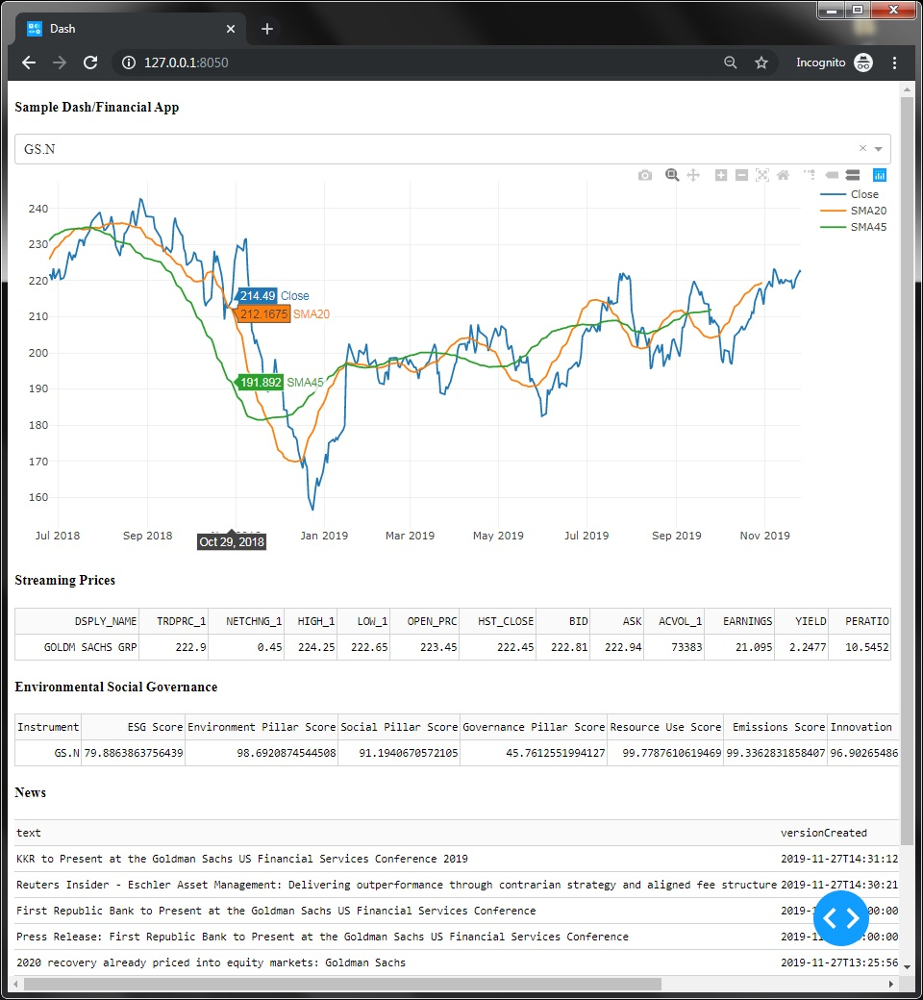

# FinancialDashboard
This is a quick example use case of building a financial dashboard type application using Plotly/Dash Framework using the RDP Library for Python. The example shows a price graph for an equity along with real-time streaming data, ESG Score and latest News headlines and stories for an equity instrument.

### Prerequisites
* Install Dash framework for Python
* Install RDP library for Python
* Credentials to retrieve snapshot and streaming data from Elektron Data Platform.
   * Machine ID
   * Password
   * App Key aka Client ID
   * Permissioned for Historical Timeseries API, ESG API, News API and ERT in Cloud streaming data.

### Run

Start the Dash application: ```python edpapp_Content.py```

Navigate the browser to URL: ```http://127.0.0.1:8050/```
   
Select the symbol from the dropdown list to view metrics for that stock. Clicking on News headline will pop open the News story.
   
### Screenshot


